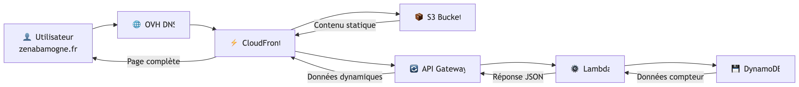

# Portfolio AWS – Infrastructure as Code avec Terraform

##  Introduction

D'abord réalisé manuellement via la console (clic), j'ai ensuite refactorisé l'intégralité en Infrastructure as Code (Terraform) pour bénéficier de l'automatisation, de la reproductibilité et du versioning.

L'infrastructure combine S3 privé, CloudFront (OAC), ACM, Lambda, API Gateway et DynamoDB, avec un compteur de visites dynamique intégré au frontend.

 **Objectif** : montrer ma maîtrise concrète d'AWS et de l'IaC, en suivant les bonnes pratiques de sécurité et de scalabilité.

 **Le but** est de démontrer ma connaissance des services AWS et de l'approche IaC.

## ⚙️ Stack technique

- **Terraform** (backend S3 + DynamoDB pour state/lock)
- **AWS S3** privé (site statique)
- **AWS CloudFront + ACM** (us-east-1) (CDN + TLS)
- **AWS Lambda + API Gateway + DynamoDB** (compteur de visites serverless)
- **AWS Budget** (alertes coûts)
- **OVH DNS** (nom de domaine personnalisé)

## 📂 Arborescence du projet

```
.
├── Architecture_Decision_Record.md
├── deploy-static-site.json
├── infra
│   ├── backend.tf
│   ├── budget.tf
│   ├── environments/
│   │   └── dev.tfvars
│   ├── lambda/
│   │   ├── build.zip
│   │   └── visit/
│   │       ├── handler.py
│   │       └── tests/
│   │           └── test_handler.py
│   ├── main.tf
│   ├── modules/
│   │   ├── bootstrap-backend/
│   │   ├── static-site/
│   │   └── visit-api/
│   ├── outputs.tf
│   ├── providers.tf
│   ├── public/
│   │   ├── CV_2025_MOGNE_ZENABA.pdf
│   │   ├── index.html
│   │   └── style.css
│   ├── terraform-backend.json
│   ├── variables.tf
│   └── versions.tf
└── README.md
```

J'ai dans un premier temps commencé par une structure simple et monolithique pour comprendre les bases de Terraform.
Les concepts augmentant, j'ai découpé l'architecture en modules distincts afin de bénéficier des avantages suivants :

Avantages de l'approche modulaire :

Réutilisabilité : Chaque module peut être réutilisé dans différents projets ou environnements
Séparation des responsabilités : Chaque module a une fonction précise et autonome
Maintenance simplifiée : Les modifications sont isolées et n'affectent pas l'ensemble du système
Collaboration facilitée : Plusieurs personnes peuvent travailler sur différents modules simultanément sans conflits
Testabilité : Chaque module peut être testé indépendamment avant intégration

Les différents modules communiquent entre eux via les outputs et variables:

```
# Déclaration d'un output dans un module
output "acm_arn" {
  value = aws_acm_certificate.site_cert.arn
}

# Utilisation dans la configuration racine
module "static_site" {
  source = "./modules/static-site"
  domain_root = var.domain_root
}

# Réutilisation de l'output dans d'autres modules ou outputs
output "certificat_ssl" {
  value = module.static_site.acm_arn
}
```

Cette architecture modulaire permet une gestion évolutive de l'infrastructure et une meilleure organisation du code Terraform, 
tout en facilitant la collaboration et la maintenance à long terme.

## Architecture du projet


CloudFront délivre le site depuis **S3 privé via OAC** (pas d'accès public direct au bucket).
L'infrastructure utilise stratégiquement deux régions AWS pour optimiser les performances et respecter les contraintes techniques.

## 🔄 Flux des Requêtes



Parcours d'une requête : 
Le contenu statique est servi via le CDN CloudFront depuis S3, tandis que les données dynamiques du compteur de visites transitent par une API serverless (Lambda + DynamoDB) avant de s'afficher sur la page. Cette architecture assure une performance globale grâce à une séparation claire entre la couche de présentation et le traitement des données.*


##  Workflow Terraform

### Étapes principales

```bash
terraform init           # Initialiser
terraform validate       # Vérifier la syntaxe
terraform fmt -recursive # Mise en forme
terraform plan           # Prévisualiser les changements
terraform apply          # Appliquer les changements
```

### Naming convention

```
<prefix>-<project>-<env>-<type>
```
Exemple : `zenaba-portfolio-dev-tfstate`

##  Gestion du state

- **S3** : stockage centralisé avec versioning + encryption AES256
- **DynamoDB** : table de lock pour éviter les apply concurrents
- **Avantages** : collaboration, rollback, sécurité

## 🌐 Déploiement du site statique

- **Bucket S3 privé** (aucun accès public)
- **CloudFront + OAC** (Origin Access Control) → seul CloudFront accède au bucket
- **Certificat ACM** en us-east-1 pour HTTPS
- **Redirection DNS OVH** (CNAME → CloudFront)

### Commandes utiles :

```bash
aws s3 sync ./public s3://$SITE_BUCKET --delete
aws cloudfront create-invalidation --distribution-id $CF_ID --paths "/*"
```

##  Compteur de visites

- **Lambda** (Python) → incrémente la valeur
- **DynamoDB** → stocke le compteur
- **API Gateway** → expose /visit
- **Frontend** → fetch de l'endpoint → affichage en temps réel

## Résultat ?

Un site hébergé sur AWS accessible à ces adresses :  
- [http://zenabamogne.fr](http://zenabamogne.fr)  
- [www.zenabamogne.fr](https://www.zenabamogne.fr)  
- [https://www.zenabamogne.fr](https://www.zenabamogne.fr)
- [zenabamogne.fr](http://zenabamogne.fr) 


## Problème rencontré & résolution (ACM/CloudFront)

**Problématique.** L’ajout de l’alias `zenabamogne.fr` dans CloudFront échouait avec comme message d'erreur :
> “The certificate that is attached to your distribution doesn't cover the alternate domain name (CNAME)…”

**Cause racine.**
- Le certificat ACM initial ne couvrait que `www.zenabamogne.fr`.
- La distribution CloudFront n’avait que `www.zenabamogne.fr` en alias.
- Rappel important : **CloudFront exige un certificat ACM en `us-east-1`** couvrant **tous** les noms ajoutés dans `aliases`.

**Correctif mis en place.**
1. Création d’un **nouveau certificat ACM** en `us-east-1` pour **`zenabamogne.fr` + `*.zenabamogne.fr`** (Terraform, provider alias `aws.use1`).
2. Exposition des **CNAMEs de validation** via les outputs Terraform ➜ ajout des CNAMEs dans **OVH DNS** ➜ état **`ISSUED`**.
3. Mise à jour de **CloudFront** :
   - `aliases = ["zenabamogne.fr", "www.zenabamogne.fr"]`
   - `viewer_certificate.acm_certificate_arn = <nouvel ARN ACM>`
4. DNS :
   - `www` ➜ **CNAME** vers la distrib CloudFront
   - **apex** `zenabamogne.fr` ➜ **redirection 301 visible** OVH vers `https://www.zenabamogne.fr` (limitation CNAME sur l’apex).


## ❓ FAQ Technique 

### Pourquoi avoir choisi une architecture avec S3 privé + CloudFront plutôt qu'un bucket S3 public ?
→ Sécurité + performances (OAC, HTTPS, cache CDN, compression, faible latence).

### Comment gérez-vous l'état Terraform et pourquoi cette méthode ?
→ Backend S3 + DynamoDB (centralisation, versioning, verrouillage concurrent, rollback).

### Pourquoi avoir implémenté un compteur de visites avec Lambda/DynamoDB plutôt qu'une solution tierce ?
→ Démonstration de compétences serverless + coûts faibles + architecture scalable.

### Quelles mesures de sécurité ont été mises en place ?
→ Bucket privé, OAC CloudFront, ACM TLS, IAM restrictive, chiffrement repos/transit, budget alertes.

### Comment améliorer pour un environnement de production ?
→ CI/CD GitHub Actions, workspaces Terraform (multi-env), CloudWatch Alarms, AWS WAF, tests Terratest.

##  Améliorations possibles

- Automatisation CI/CD (GitHub Actions → Terraform plan/apply)
- Multi-environnements (dev/staging/prod)
- Monitoring et alertes (CloudWatch + SNS)
- Sécurité avancée (WAF, Secrets Manager)
