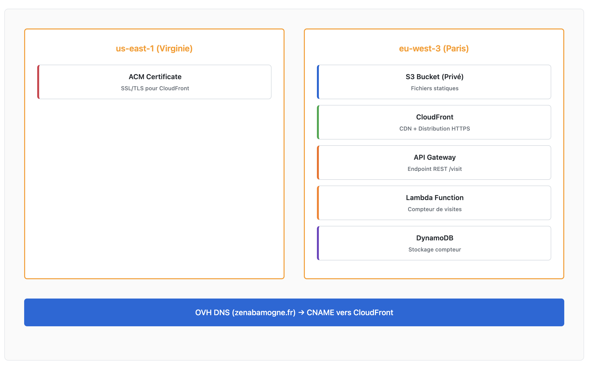
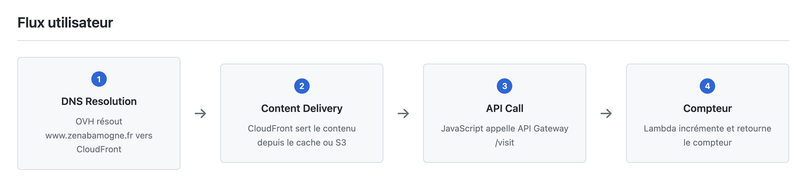
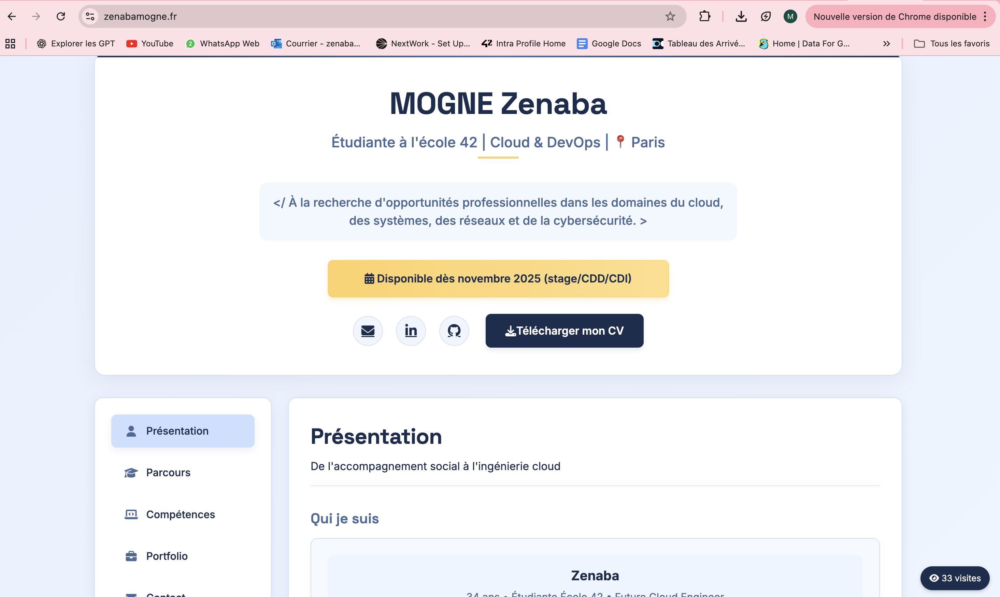

# Portfolio AWS – Infrastructure as Code avec Terraform

##  Introduction

D'abord réalisé manuellement via la console (clic), j'ai ensuite refactorisé l'intégralité en Infrastructure as Code (Terraform) pour bénéficier de l'automatisation, de la reproductibilité et du versioning.

L'infrastructure combine S3 privé, CloudFront (OAC), ACM, Lambda, API Gateway et DynamoDB, avec un compteur de visites dynamique intégré au frontend.

 **Objectif** : montrer ma maîtrise concrète d'AWS et de l'IaC, en suivant les bonnes pratiques de sécurité et de scalabilité.

 **Le but** est de démontrer ma connaissance des services AWS et de l'approche IaC.

## ⚙️ Stack technique

- **Terraform** (backend S3 + DynamoDB pour state/lock)
- **AWS S3** privé (site statique)
- **AWS CloudFront + ACM** (us-east-1) (CDN + TLS)
- **AWS Lambda + API Gateway + DynamoDB** (compteur de visites serverless)
- **AWS Budget** (alertes coûts)
- **OVH DNS** (nom de domaine personnalisé)

## 📂 Arborescence du projet

```
.
├── Architecture_Decision_Record.md
├── deploy-static-site.json
├── infra
│   ├── backend.tf
│   ├── budget.tf
│   ├── environments/
│   │   └── dev.tfvars
│   ├── lambda/
│   │   ├── build.zip
│   │   └── visit/
│   │       ├── handler.py
│   │       └── tests/
│   │           └── test_handler.py
│   ├── main.tf
│   ├── modules/
│   │   ├── bootstrap-backend/
│   │   ├── static-site/
│   │   └── visit-api/
│   ├── outputs.tf
│   ├── providers.tf
│   ├── public/
│   │   ├── CV_2025_MOGNE_ZENABA.pdf
│   │   ├── index.html
│   │   └── style.css
│   ├── terraform-backend.json
│   ├── variables.tf
│   └── versions.tf
└── README.md
```
## Architecture




## Flux utilisateur 




##  Workflow Terraform

### Étapes principales

```bash
terraform init           # Initialiser
terraform validate       # Vérifier la syntaxe
terraform fmt -recursive # Mise en forme
terraform plan           # Prévisualiser les changements
terraform apply          # Appliquer les changements
```

### Naming convention

```
<prefix>-<project>-<env>-<type>
```
Exemple : `zenaba-portfolio-dev-tfstate`

##  Gestion du state

- **S3** : stockage centralisé avec versioning + encryption AES256
- **DynamoDB** : table de lock pour éviter les apply concurrents
- **Avantages** : collaboration, rollback, sécurité

## 🌐 Déploiement du site statique

- **Bucket S3 privé** (aucun accès public)
- **CloudFront + OAC** (Origin Access Control) → seul CloudFront accède au bucket
- **Certificat ACM** en us-east-1 pour HTTPS
- **Redirection DNS OVH** (CNAME → CloudFront)

### Commandes utiles :

```bash
aws s3 sync ./public s3://$SITE_BUCKET --delete
aws cloudfront create-invalidation --distribution-id $CF_ID --paths "/*"
```

##  Compteur de visites

- **Lambda** (Python) → incrémente la valeur
- **DynamoDB** → stocke le compteur
- **API Gateway** → expose /visit
- **Frontend** → fetch de l'endpoint → affichage en temps réel

## Résultat ?

Un site hébergé sur AWS accessible à ces adresses :  
- [zenabamogne.fr](https://zenabamogne.fr)  
- [http://zenabamogne.fr](http://zenabamogne.fr)  
- [https://zenabamogne.fr](https://zenabamogne.fr)  
- [www.zenabamogne.fr](https://www.zenabamogne.fr)  
- [https://www.zenabamogne.fr](https://www.zenabamogne.fr)



## ❓ FAQ Technique 

### Pourquoi avoir choisi une architecture avec S3 privé + CloudFront plutôt qu'un bucket S3 public ?
→ Sécurité + performances (OAC, HTTPS, cache CDN, compression, faible latence).

### Comment gérez-vous l'état Terraform et pourquoi cette méthode ?
→ Backend S3 + DynamoDB (centralisation, versioning, verrouillage concurrent, rollback).

### Pourquoi avoir implémenté un compteur de visites avec Lambda/DynamoDB plutôt qu'une solution tierce ?
→ Démonstration de compétences serverless + coûts faibles + architecture scalable.

### Quelles mesures de sécurité ont été mises en place ?
→ Bucket privé, OAC CloudFront, ACM TLS, IAM restrictive, chiffrement repos/transit, budget alertes.

### Comment améliorer pour un environnement de production ?
→ CI/CD GitHub Actions, workspaces Terraform (multi-env), CloudWatch Alarms, AWS WAF, tests Terratest.

##  Améliorations possibles

- Automatisation CI/CD (GitHub Actions → Terraform plan/apply)
- Multi-environnements (dev/staging/prod)
- Monitoring et alertes (CloudWatch + SNS)
- Sécurité avancée (WAF, Secrets Manager)