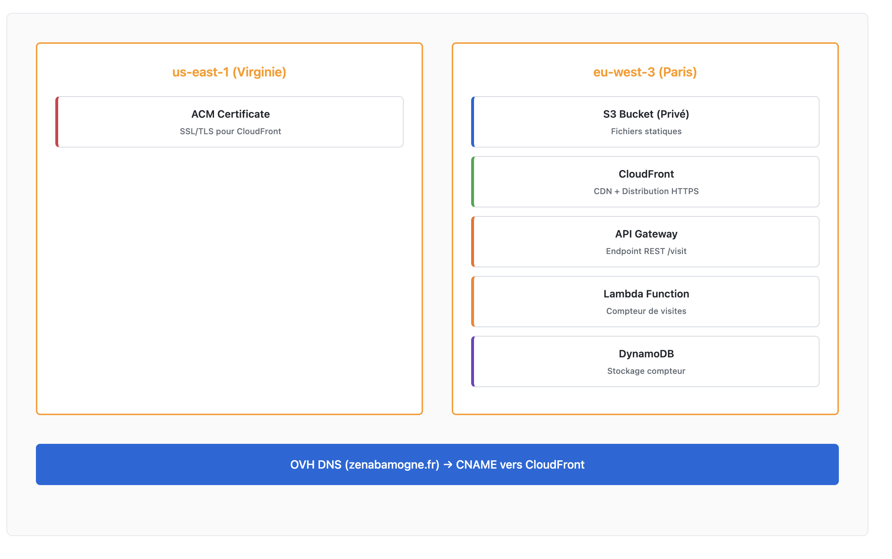
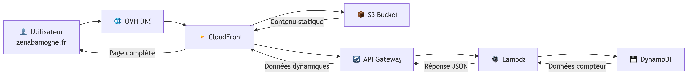
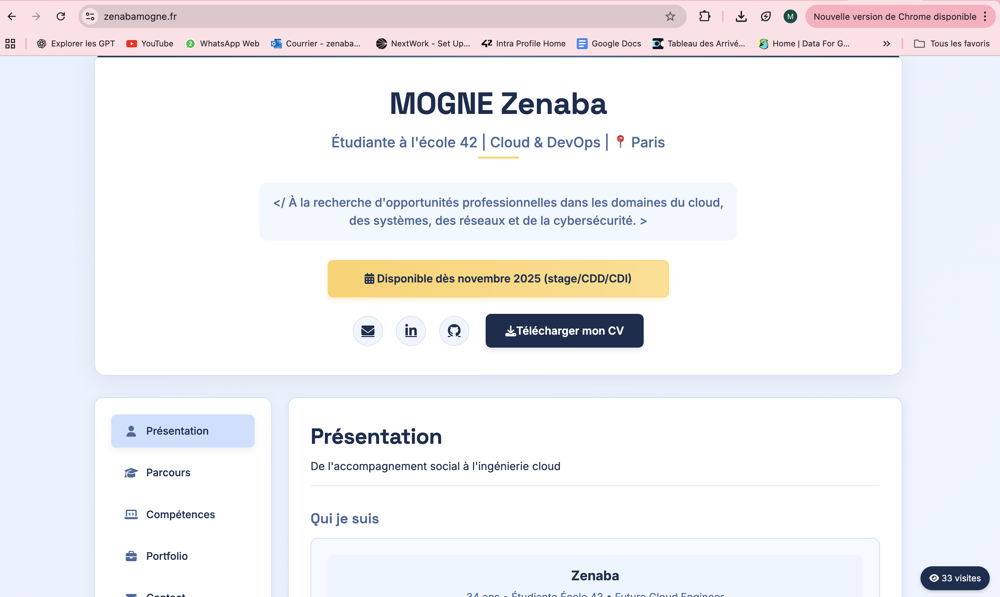

# Portfolio AWS – Infrastructure as Code avec Terraform

##  Introduction

This project was a hands-on way to explore AWS services by building something real and personal : my own portfolio website.
I first built it manually in the AWS Console to understand how each service works (S3, CloudFront, ACM, Lambda, API Gateway, and DynamoDB) before automating everything with Terraform.

The goal was to turn a manually created infrastructure into a fully reproducible, automated, and versioned deployment, trying to follow IaC best practices.
I also registered a custom domain on OVHCloud and configured DNS and SSL with AWS.
It was a great challenge to make both zenabamogne.fr and www.zenabamogne.fr work properly with HTTPS, while learning the relationship between ACM, CloudFront, and DNS zones.

Beyond AWS, this project helped me:

Build the entire frontend (HTML/CSS) from scratch,
Integrate a serverless visit counter (Lambda + API Gateway + DynamoDB),
Understand security layers like OAC, encryption, IAM, and budget monitoring.

In short, it turned theory into practice : a complete, functional, and evolving cloud project I fully understand end-to-end.

**November 2025 Update**: Migrated to Terraform 1.10+ native S3 locking, eliminating the need for DynamoDB table for state locking. This reduces infrastructure complexity and costs while maintaining the same distributed locking functionality.

Live: [www.zenabamogne.fr](www.zenabamogne.fr) 

## ⚙️ Tech stack

- **Terraform** (S3 backend + native S3 locking - Terraform 1.10+)
- **AWS S3** (private static hosting)
- **AWS CloudFront + ACM** (us-east-1) CDN & HTTPS
- **AWS Lambda + API Gateway + DynamoDB** (serverless visit counter)
- **AWS Budget** (cost alerts)
- **OVHCloud DNS** (domain and DNS management)

## 📂 Project Structure

```
.
├── Architecture_Decision_Record.md
├── deploy-static-site.json
├── infra
│   ├── backend.tf
│   ├── budget.tf
│   ├── environments/
│   │   └── dev.tfvars
│   ├── lambda/
│   │   ├── build.zip
│   │   └── visit/
│   │       ├── handler.py
│   │       └── tests/
│   │           └── test_handler.py
│   ├── main.tf
│   ├── modules/
│   │   ├── bootstrap-backend/
│   │   ├── static-site/
│   │   └── visit-api/
│   ├── outputs.tf
│   ├── providers.tf
│   ├── public/
│   │   ├── CV_MOGNE_ZENABA.pdf
│   │   ├── index.html
│   │   └── style.css
│   ├── terraform-backend.json
│   ├── variables.tf
│   └── versions.tf
└── README.md
```

The infrastructure started as a simple monolith, then evolved into multiple Terraform modules for reusability and clarity:
- bootstrap-backend: S3 with native locking (Terraform 1.10+) for Terraform state
- static-site: S3 + CloudFront + ACM
- visit-api: Lambda + API Gateway + DynamoDB


Each Terraform module communicates via variables and outputs, enabling a modular, reusable design:

```
# Example: passing the ACM certificate ARN between modules
output "acm_arn" {
  value = aws_acm_certificate.site_cert.arn
}

module "static_site" {
  source = "./modules/static-site"
  domain_root = var.domain_root
}

output "ssl_certificate" {
  value = module.static_site.acm_arn
}
```

This modular approach improves maintenance, scalability, and teamwork readiness.

## Architecture




CloudFront securely delivers the website from a **private S3 bucket** using **OAC (Origin Access Control)**.
The ACM certificate is hosted in us-east-1 to meet CloudFront’s regional requirement.

## 🔄 Request Flow



Static content is served through CloudFront’s CDN from S3,
while dynamic data (the visit counter) passes through API Gateway → Lambda → DynamoDB,
before being displayed on the frontend.
This ensures a **clean separation** between presentation and data logic.


##  Terraform Workflow

### Principals steps

```bash
terraform init           # Initialize
terraform validate       # Validate syntax
terraform fmt -recursive # Format code
terraform plan           # Preview changes
terraform apply          # Apply changes
```

### Naming convention

```
<prefix>-<project>-<env>-<type>
```
Example : `zenaba-portfolio-dev-tfstate`

##  State Management

Terraform uses a **remote backend** for safety and collaboration:

- **S3** stores the state file (versioned & AES256 encrypted)

- **Native S3 locking** (Terraform 1.10+) prevents concurrent apply operations
  
✅ Benefits: consistency, rollback, team collaboration, and reduced infrastructure complexity.

## 🌐 Deployment Summary

- **Private S3 bucket** (no public access)
- **CloudFront + OAC** (secure S3 access)
- **ACM certificate** (us-east-1) for HTTPS
- **DNS (OVH)**: www → CloudFront, apex redirects to www

### Useful Command to deploy your static site and refresh CloudFront’s cache :

```bash
# Upload (sync) all local files in ./public to your S3 bucket.
# - Adds/updates changed files
# - --delete removes files in the bucket that no longer exist locally
aws s3 sync ./public s3://$SITE_BUCKET --delete

# Invalidate CloudFront cache for all paths so users get the latest files immediately.
# (Without this, CloudFront might keep serving older cached versions.)
aws cloudfront create-invalidation --distribution-id $CF_ID --paths "/*"
```
Quick tips:

- After a sync, HTML might still be cached—this invalidation fixes that.
- If only a few files changed, you can invalidate specific paths (e.g., "/index.html" "/app.js").
- Make sure $SITE_BUCKET and $CF_ID are set (you can output them from Terraform).

## Visit Counter Logic

- **Lambda** (Python) → increments visit count
- **DynamoDB** → stores it persistently
- **API Gateway** → exposes /visit endpoint
- **Frontend** → fetches the API and displays the counter in real time

## 🌍 Live Website

Accessible at:  
- [http://zenabamogne.fr](http://zenabamogne.fr)  
- [www.zenabamogne.fr](https://www.zenabamogne.fr)  
- [https://www.zenabamogne.fr](https://www.zenabamogne.fr)
- [zenabamogne.fr](http://zenabamogne.fr) 




## 💬 FAQ - Technical insights

### Why start with the AWS Console first?
To understand how each service connects.
Building it manually gave me a clear view before automating with Terraform.

### Why Terraform instead of CloudFormation?
Terraform is multi-cloud and uses HCL, it's a reusable language.
It allowed me to focus on IaC.

### How is security and performance handled?
The website is served from a private S3 bucket via CloudFront (OAC).
TLS (ACM) is managed in us-east-1, all traffic is HTTPS, and static assets are cached and compressed for low latency.

### What were the main challenges?
- Validating the ACM certificate with OVH DNS (CNAME propagation)
- Managing HTTPS redirection between zenabamogne.fr and www.zenabamogne.fr
- Integrating the serverless visit counter (Lambda + API Gateway + DynamoDB)

### How is Terraform state managed?
The state is stored in S3 (versioned + encrypted),
and native S3 locking (Terraform 1.10+) handles locking to prevent concurrent updates.

##  Next Steps ?

- CI/CD automation (GitHub Actions + OIDC)

- Monitoring and alerts (CloudWatch + SNS)
